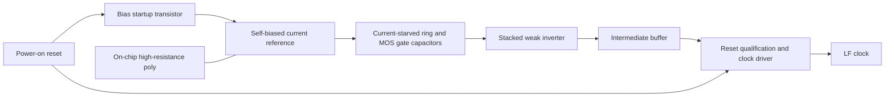

# GF180 low-power oscillator candidate

This is a transistor-level design for RISCay-MCU's always-on timer, based on
[Tim Edwards' current-starved oscillator](https://github.com/RTimothyEdwards/sky130_ef_ip__rc_osc_500k).
The objective is low total oscillator supply power, with frequency free to fall
into the Hz range. Both asynchronous MCU variants should eventually share this
same macro. Attribution, upstream copies and pinned sources are in
[NOTICE.md](NOTICE.md), [upstream/](upstream/) and [sources.json](sources.json).

**Status: schematic candidate with reproducible GF180 SPICE experiments.**
No layout, extracted parasitics, DRC/LVS signoff, mismatch/noise qualification,
silicon measurements or qualified POR circuit is supplied. The digital SoC now
uses this candidate's nominal slow timing and POR interface, with separate
executable timing models; physical macro binding remains outstanding.
See [integration](#integration-with-the-mcu).

## Circuit

The physical source is [riscay_lf_osc_gf180.spice](riscay_lf_osc_gf180.spice),
generated by [design.py](design.py); [candidate.json](candidate.json) records
the selected dimensions. All active devices use GF180 `nmos_3p3`/`pmos_3p3`.



- A beta multiplier replaces the original supply-fed bias resistor. A 4:1 NMOS
  size ratio develops a small voltage across the source resistor, allowing much
  less current for a given resistor area. It is supply-dependent and untrimmed;
  it is not a precision voltage or current reference.
- Mirrored NMOS/PMOS currents limit each ring stage. Ordinary NMOS transistors
  with source, drain and bulk grounded provide timing capacitance through their
  gates. Their nonlinear capacitance is included in the MOS models. This avoids
  requiring a MIM capacitor option.
- Long-channel series devices reduce output-buffer current during slow input
  ramps. An intermediate inverter sharpens transitions before the output gate
  and driver. Supply-current measurement includes every one of these blocks.
- POR forces the bias away from its zero-current equilibrium and parks the ring.
  Clock output is held low while reset is asserted. No firmware, crystal,
  external timing resistor or off-chip timing capacitor is needed.

Pin order is `vdd vss rst_n clk`. Supply and signal levels are 3.3 V nominal.
`rst_n` is an **internal POR/startup connection**, not a requested new package
pin. Hold it low throughout the supply ramp and for at least 5 ms after supply
is valid. The candidate has no internal POR generator. Tying `rst_n` high at
power-up violates its startup contract. Reset consumes more current than normal
oscillation; it is not a sleep or power-down input. Keep the oscillator running
during retained sleep. Removing its supply turns it off.

## Power, frequency and area

See [characterization.md](characterization.md) for the selected candidate's
measured simulation results, the explored alternatives and exact limits.
"Lowest power" here means the best passing candidate in the recorded search;
it does not mean a proven global minimum across all oscillator architectures.

The sweep explores 30/100/300 MOhm nominal source resistors, 3/5/7 stages and
2/4/8 devices per weak-buffer branch. Timing devices are 10 um wide and 10 um
long in the final comparison. Frequency is measured, not constrained to 4 kHz.
Stopped or fading oscillations cannot win the power comparison.

The resistor is physically significant. The 300 MOhm candidate uses roughly
95,436 um of 1 um-wide high-resistance poly: **0.0954 mm² of resistor body**.
At the minimum 0.4 um inter-resistor spacing, an idealized packed strip estimate
is about 0.134 mm², before terminals, turns, guard structures, routing and the
rest of the circuit. This is an area estimate, not a placed macro result. The
ten long model segments describe an electrical design; physical folding and
segmentation must be designed and extracted.

This design requires the GF180 **3 kOhm/square HRES option**. The
[HRES rules](https://gf180mcu-pdk.readthedocs.io/en/latest/physical_verification/design_manual/drm_10_03.html)
specify an additional process mask for high-resistance poly and a 1 um minimum
width. Confirm that the selected fabrication run includes the required option.
It is not automatically available just because the process is called GF180.
Changing to another resistor option requires resizing and a new characterization.

## Reproduce the checks

Python 3.10+ and ngspice are required. The recorded experiments use ngspice 42.
Run from the repository root, using a new output directory for every campaign:

```sh
python3 analog/gf180-lf-osc/design.py
python3 -m unittest discover -s analog/gf180-lf-osc -p 'test_*.py' -v
python3 analog/gf180-lf-osc/characterize.py --fetch-models --suite nominal --output build/lf-nominal
python3 analog/gf180-lf-osc/characterize.py --suite sweep --jobs 3 --output build/lf-sweep
python3 analog/gf180-lf-osc/characterize.py --suite pvt --jobs 3 --output build/lf-pvt
python3 analog/gf180-lf-osc/characterize.py --suite controls --output build/lf-controls
```

On this Windows workstation, use WSL Ubuntu to run the SPICE commands, for
example `wsl -d Ubuntu -- bash -c 'cd /mnt/p/Personal/RISCay-MCU && python3 ...'`.
Python unit tests also run natively on Windows. Model fetching verifies pinned
SHA-256 hashes, needs no account, and writes only under ignored `.tools/`.
Waveforms, decks, logs and reports remain under ignored `build/`.

Every campaign first checks the high-resistance poly model against an independent
DC calculation at three resistor corners and three temperatures. A narrowly
scoped compatibility transformation is necessary with the pinned raw model:
ngspice 42 incorrectly takes `l=r_l` as the resistance in its behavioral body
resistor. The prepared copy removes that model/geometry prefix and retains the
complete resistance expression, temperature coefficients, terminal resistors,
substrate capacitors and corner parameters. MOS models are unchanged. This omits
the body's noise-only metadata; **noise and jitter are not characterized**.
The transformation fails on an unexpected source statement, leaves the original
file intact, and records the prepared model hash in every report.

The runner uses time-domain integration over complete settled clock cycles,
with interpolated window endpoints. It checks startup, full-swing output edges,
continued late oscillation, period consistency, reset parking, simulator errors
and complete waveforms. The exploratory output-slew bound is 1 us at the stated
load; actual library limits must replace it during integration. The negative
SPICE control holds reset asserted: success means the checker rejected that
non-oscillating circuit, not that the oscillator passed. Missing tools, timeouts
and stale waveforms never count as passes.

## Integration with the MCU

Both reference SoCs now count single LF ticks in the Gray domain and scale time
after synchronization, with nominal 7.7307 Hz and guarded 5..12 Hz assumptions.
Watchdog counts, freshness, sample cadence, board confirmation and leases have
been revised together. The digital LF view uses `rst_n/clk`, with implicit
supplies; the obsolete enable/trim interface has been removed. No trim DAC is
implied. The fast service source can stop and restart through a separate physical
IP boundary. See [the full timing and wake contract](../../docs/sleep-and-clock.md).

Before physical binding, supply a qualified on-chip POR and its hold timing,
independent of firmware or this clock. Qualify output loading/slew, clock
distribution, supply noise, PVT plus mismatch, brownouts, reset timing, layout
parasitics and leakage. The fast oscillator also needs an actual analog design
meeting its digital startup/stop contract. These LF oscillator results remain
schematic measurements and are not whole-MCU sleep-power measurements.
